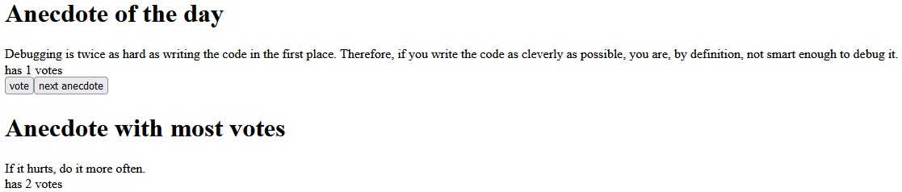

<h1>Overview:</h1>

This is an application which displays anecdotes and allows users to vote for them using react as the front end framework. It was made to practice managing state in a React app using the built in state hooks and using components. This application will server as the basis for more complex applications throughout the course.

 
<h1>How to Run:</h1>
<ol>
    <li>Download the code and run the command 'npm install' in the root directory to install all the package dependencies.</li>
    <li>Run 'npm start' to start the application locally on port 3000.</li>
    <li>Access the application at http://localhost:3000/ through your browser.</li>
</ol>

 
<h1>Working Example:</h1>

 
<h1>Technologies:</h1>

