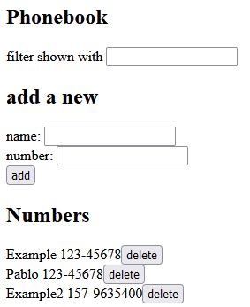

<h1>Overview:</h1>

This application is a continuation of the phonebook app built in previous chapters.
In this part we added a back end to the app using the express framework and Node.js. Additionally, we built the front end and served it as default from the backend. The back end now uses a MongoDB database and communicates with it using the mongoose library.

 
<b>**Check it out! This application is currently hosted on Fly.io at: https://wispy-frog-950.fly.dev/</b>

 
<h1>How to Run:</h1>
<ol>
    <li>Download the code and run the command 'npm install' in the root directory to install all the package dependencies.</li>
    <li>Run 'npm start' to start the application locally on port 3001.</li>
    <li>Access the application at http://localhost:3001/ through your browser.</li>
</ol>

 
<h1>Working Example:</h1>

 
<h1>Technologies:</h1>

