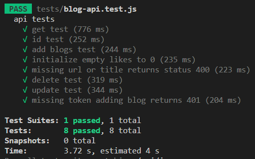

<h1>Overview:</h1>
<ol>
<li>This application implements an Express backend in Node.js which stores blog and user data in a MongoDB database hosted on Mongo Atlas.</li>
<li>It offers the ability to create new users and login to receive a timed authentication token managed with the JSON-Webtoken library. The password encryption is performed using the bcrypt library.</li>
<li>Additionally it offers the ability to add, modify or remove blogs by authenticated users.</li>
<li>This functionality was tested using the unit-tests declared in the './test' directory.</li>
<li>The unit-tests use the Mongoose library and the SuperTest to communicate with the database and Jest testing framework to orchestrate the tests.</li>
</ol>

 
<h1>How to Run:</h1>
<ol>
    <li>Download the code and run the command 'npm install' in the root directory to install all the package dependencies.</li>
    <li>Run 'npm test' in the root directory to run all of the unit tests declared in the './tests' directory using Jest.</li>
</ol>

 
<h1>API Unit Test Results Example:</h1>

 
<h1>Technologies:</h1>

