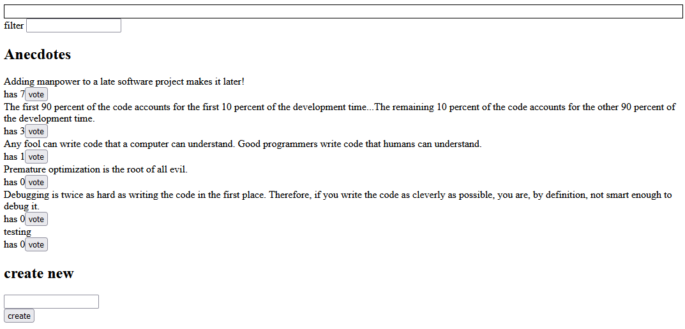

<h1>Overview:</h1>

This application is a continuation of the anecdotes app built in previous chapters.
It offers the ability to add and vote for anecdotes which are stored in a local database managed by json-server.
This implementation was used to test Redux, Redux-Toolkit and React-Query configurations.

 

<h1>How to Run:</h1>
<ol>
    <li>Download the code and run the command 'npm install' in the root directory to install all the package dependencies.</li>
    <li>Run 'npm run server' in the root directory to start the backend locally on port 3001.</li>
    <li>Run 'npm start' to start the application locally on port 3000.</li>
    <li>Access the application at http://localhost:3000/ through your browser.</li>
</ol>

 
<h1>Working Example:</h1>

 
<h1>Technologies:</h1>

