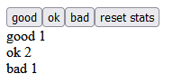

<h1>Overview:</h1>

This application is a continuation of the unicafe app built in previous chapters.
It offers the ability to input votes with the options being Good, OK, and Bad.
In this implementation the vote counts are stored in the app and have no permanence.
This implementation was used to test Redux and Reducers.

 

<h1>How to Run:</h1>
<ol>
    <li>Download the code and run the command 'npm install' in the root directory to install all the package dependencies.</li>
    <li>Run 'npm start' to start the application locally on port 3000.</li>
    <li>Access the application at http://localhost:3000/ through your browser.</li>
</ol>

 
<h1>Working Example:</h1>

 
<h1>Technologies:</h1>

