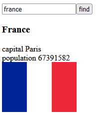

<h1>Overview:</h1>

This application is a continuation of the country app built in previous chapters.
It offers the ability to search for countries through the https://restcountries.com/ REST API and display some of their information.
This implementation was used to test React Router, and the creation of Custom Hooks.

 

<h1>How to Run:</h1>
<ol>
    <li>Download the code and run the command 'npm install' in the root directory to install all the package dependencies.</li>
    <li>Run 'npm start' to start the application locally on port 3000.</li>
    <li>Access the application at http://localhost:3000/ through your browser.</li>
</ol>

 
<h1>Working Example:</h1>

 
<h1>Technologies:</h1>

