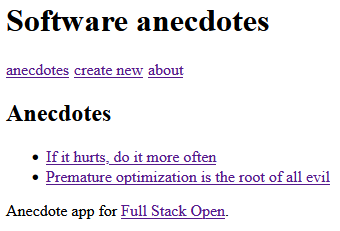
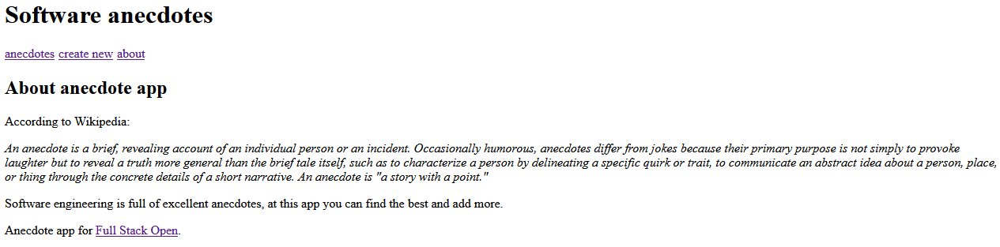

<h1>Overview:</h1>

This application is a continuation of the anecdotes app built in previous chapters.
It offers the ability to add and vote for anecdotes with each functionality residing in its own page. The pages can be navigated thanks to React Router.
This implementation was used to test React Router and the ability to have multiple 'pages' in a single page react app.

 
<h1>How to Run:</h1>
<ol>
    <li>Download the code and run the command 'npm install' in the root directory to install all the package dependencies.</li>
    <li>Run 'npm start' to start the application locally on port 3000.</li>
    <li>Access the application at http://localhost:3000/ through your browser.</li>
</ol>

 
<h1>Working Example:</h1>

 
<h1>Technologies:</h1>

