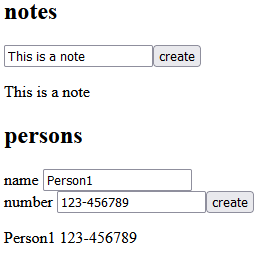

<h1>Overview:</h1>

This application is made to test custom hooks and use them to communicate with the backend using axios.
It offers the ability to add notes and people (both using the same custom hook as a base) which are stored in a local database managed by json-server.

 
<h1>How to Run:</h1>
<ol>
    <li>Download the code and run the command 'npm install' in the root directory to install all the package dependencies.</li>
    <li>Run 'npm run server' in the root directory to start the backend locally on port 3005.</li>
    <li>Run 'npm start' to start the application locally on port 3000.</li>
    <li>Access the application at http://localhost:3000/ through your browser.</li>
</ol>

 
<h1>Working Example:</h1>

 
<h1>Technologies:</h1>

